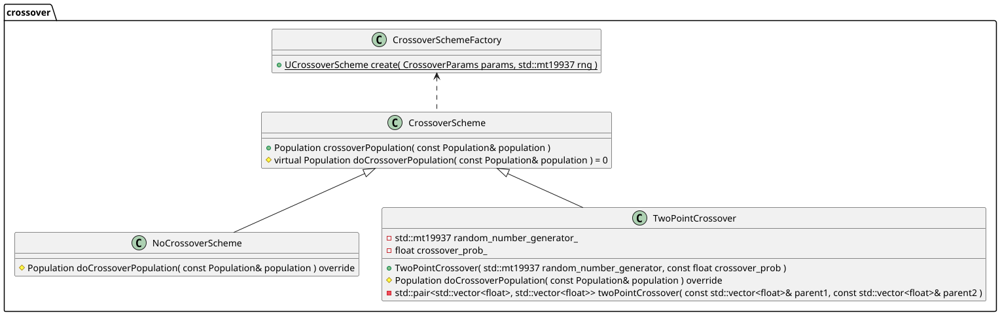
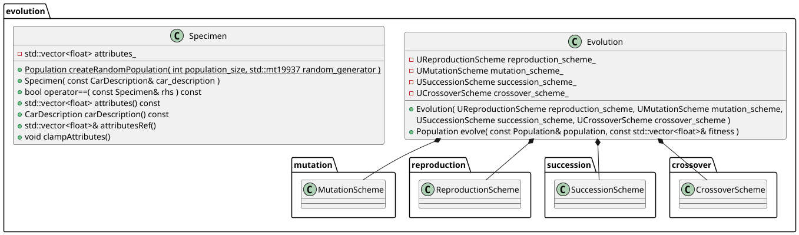

# Dokumentacja Końcowa
* Mikołaj Garbowski
* Michał Łuszczek

## Temat projektu
Oprogramowanie przeprowadzające ewolucję sztucznych pojazdów w 2D. Chodzi o wyewoluowanie pojazdu,
który dotrze jak najszybciej do końca. Coś podobnego dostępne jest pod adresem: http://rednuht.org/genetic_cars_2/.
Przydatna może być biblioteka do symulacji fizyki, np. Box2D. Stopień skomplikowania trasy powinien rosnąć wraz
z odległością od początku. Trasa powinna jednak być przejezdna dla domyślnego pojazdu. Ewolucja powinna odbywać się
na różnych trasach, aby możliwe było wyewoluowanie jak najlepszego pojazdu, a nie tylko dopasowanie się do konkretnej
losowej trasy, tak aby przeskoczyć konkretną dolinkę. Przed rozpoczęciem realizacji projektu proszę zapoznać się
z zawartością http://staff.elka.pw.edu.pl/~rbiedrzy/ZPR/index.html.

## Ogólny opis rozwiązania

Projekt składa się z aplikacji desktopowej przedstawiającej wizualizację przebiegu symulacji
ewolucji pojazdów 2D oraz interfejsu użytkownika do konfigurowania parametrów symulacji.

Po uruchomieniu użytkownik może dopasować parametry symulacji (np. grawitacja), ewolucji (populacja, rodzaj reprodukcji, krzyżowania, mutacji, sukcesji), generacji drogi (np. długość). 
Po wystartowaniu symulacji wizualizowane są przebiegi symulacji dla pierwszego pokolenia. Po tym, jak wszystkie pojazdy z obecnego pokolenia dojadą do celu, utkną w miejscu lub wyczerpany zostanie limit obliczeniowy, przeprowadzana jest ewolucja i proces jest powtarzany dla nowej populacji.
Podczas wizualizacji symulacji w lewym górnym rogu okna wyświetlany jest również model najlepszego pojazdu do tej pory wraz z dodatkowymi informacjami na jego temat.

Ewolucja pojazdów przeprowadzana jest korzystając z algorytmu ewolucyjnego naszego autorstwa z wieloma opcjami customizacji.

Funkcja celu wyliczana jest na podstawie przejechanej odległości i czasu. Wagi tych składowych są możliwe do zmiany w panelu konfiguracyjnym przed rozpoczęciem symulacji.

Pojazd składa się z kadłuba zbudowanego z trójkątów o wspólnym centralnym wierzchołku oraz dwóch kół o osiach w zewnętrznych wierzchołkach trójkątów kadłuba, kręcących się ze stałą prędkością kątową. 
Pojazdy są zdefiniowane przez genom, gdzie genami są:
położenie zewnętrznych wierzchołków trójkątów kadłuba,
gęstość kadłuba,
gęstość koła tylnego,
gęstość koła przedniego,
promień koła tylnego,
promień koła przedniego.

Trasa, po której poruszają się pojazdy, generowana jest za pomocą algorytmu Szumu Perlina w 1d. Dla każdego pokolenia jest generowana na nowo, aby uniknąć dopasowywania się osobników do jednej konkretnej trasy.

Dokładne działanie algorytmu ewolucyjnego, funkcji celu i szumu Perlina opisane są w sekcji "[[#Wykorzystane algorytmy]]" 


## Zrealizowane funkcjonalności:
Udało nam się zrealizować wszystkie zaplanowane funkcjonalności i kilka nie planowanych, które dają użytkownikowi większą kontrolę nad środowiskiem symulacji i ewolucji.
1. Przeprowadzenie symulacji przejazdu populacji pojazdów dla iteracji algorytmu ewolucyjnego
2. Wizualizacja przebiegu symulacji
	1. podgląd wszystkich pojazdów na trasie jednocześnie
	2. kamera podążająca za najdalej położonym pojazdem
	3. kamera podążająca jedynie za pojazdami, które jeszcze nie dotarły do celu ani nie utknęły w miejscu
3. Przeprowadzenie ewolucji pojazdów pomiędzy iteracjami
4. Dobieranie parametrów symulacji w GUI:
	1. wybór siły grawitacji
	2. wybór górnego limitu obliczeniowego dla jednej symulacji (liczba kroków)
5. Dobieranie parametrów ewolucji w GUI:
	1. Rozmiaru populacji
	2. Wagi końcowej odległości pojazdu i czasu, w którym go osiągnął jako składowych funkcji celu
	3. Wariantu reprodukcji
		1. Rozmiaru turnieju w reprodukcji turniejowej
	4. Wariantu krzyżowania
		1. Prawdopodobieństwa krzyżowania w krzyżowaniu dwupunktowym
	5. Wariantu mutacji
		1. Siły mutacji w mutacji Gaussowskiej
	6. Wariantu sukcesji
		1. Rozmiaru elity w sukcesji elitarnej
6. Dobieranie parametrów generacji drogi w GUI:
	1. Ilość punktów definiujących
	2. Parametry algorytmu szumu Perlina - wielkość siatki, liczba nałożonych warstw szumu (wyjaśnienie szumu Perlina w dalszej części)
	3. Odległość między punktami definiującymi drogę
	4. Maksymalna amplituda zmiany wysokości trasy między sąsiednimi punktami
7. Wystartowanie ewolucji o ustawionych parametrach
8. Przedstawienie wyniku symulacji
	1. Model najlepszego pojazdu wyświetlany w rogu ekranu
	2. Genom najlepszego pojazdu wyświetlany w jednym z okien GUI


Jednym z największych wyzwań przy pracy nad projektem było zapoznanie się z API wykorzystanych bibliotek, w szczególności na styku SFML i Box2D. Trudności sprawiało nam wydobycie danych na temat obiektów w symulacji silnika fizycznego Box2D i odwzorowanie ich na obiekty kształtów z biblioteki graficznej (SFML) do wyświetlenia na ekranie, ze względu na: różne układy współrzędnych w bibliotekach, tworzenie przez fizyczne obiekty hierarchii i używanie współrzędnych względnych, stosowanie złożonych przekształceń widoku.  
Problemy udało nam się pomyślnie rozwiązać tworząc odpowiednie abstrakcje rozdzielające odczytywane dane od szczegółów API danej biblioteki.


## Architektura
Program napisany jest w języku C++, z wykorzystaniem bibliotek zewnętrznych Box2d, ImGui i SFML. Do testowania wykorzystujemy bibliotekę Google Test. Budowanie aplikacji automatyzujemy przez Cmake. Repozytorium kodu trzymane jest na Githubie, na którym korzystamy też z narzędzia Github Actions w celu automatycznego testowania aplikacja przy każdej aktualizacji.

Każdy samochód powiązany jest z osobnym "światem" (symulacją) Box2d w celu ułatwienia zarządzaniem tworzenia i przeprowadzania symulacji grupowych.

Program podzielony jest na następujące moduły:
- App
- Common
- Evolution
- Road
- Simulation


### App
Odpowiada za program wykonywalny, wyświetlenie symulacji, interfejs użytkownika i konsolidację całego procesu ewolucji i symulacji dla wielu pojazdów jednocześnie. 
Zawiera punkt wejścia do aplikacji main.cc, który wprawia w ruch cały proces. Korzysta ze wszystkich pozostałych modułów. 
Najważniejsze klasy:
- EvolutionManager - skupia w sobie wszystko, co potrzebne do przeprowadzenia cyklu symulacja -> ewolucja -> symulacja. Zawiera manager symulacji fizycznych SimulationManager, schemat przeprowadzanej ewolucji Evolution, aktualną populację, funkcję celu i generator drogi używany podczas rozpoczynania symulacji dla nowej populacji.  
- SimulationManager - zapewnia wygodny interfejs zarządzania wieloma symulacjami fizycznymi pojedynczych pojazdów jednocześnie. Synchronizuje ich przebieg, udostępnia dane o najlepszym pojeździe, informuje zakończeniu wszystkich symulacji. Pojedyncza symulacja pojazdu jest obiektem klasy CarSimulation z modułu Simulation.
- Window - zapewnia interfejs do wyświetlania całej aplikacji. Do narysowania wszystkich symulacji nałożonych na siebie wykorzystuje dane z EvolutionManagera.


### Common
Klasy pomocnicze wspólne dla wszystkich modułów
Klasy:
- CarDescription - definicja opisu pojazdu. Ułatwia przekazywanie informacji o pojazdach między modułami.
- Position - reprezentacja pozycji w 2D. 


### Evolution
Moduł dostarczający narzędzia do wykorzystania algorytmu ewolucyjnego. Podzielony na pod-moduły dostarczające wariantów składowych ewolucji:
- Crossover - dostarcza wariantów krzyżowania
 
- Mutation - dostarcza wariantów mutacji

- Reproduction - dostarcza wariantów reprodukcji

- Succession - dostarcza wariantów sukcesji


Do łatwego tworzenia różnych wariantów poszczególnych składowych i zapewnienia jednolitego interfejsu używamy wzorca fabryki. Każda składowa ma swoją fabrykę. Każda fabryka używa wzorca wizytatora do tworzenia odpowiedniego wariantu klasy na podstawie typu podanych parametrów.
Najważniejsze klasy:
- Evolution - konsolidacja wszystkich składowych algorytmu ewolucyjnego, pozwala na wygenerowanie nowej populacji pojazdów na podstawie aktualnej populacji i wartości funkcji celu dla każdego osobnika. Korzysta z klas ReproductionScheme, CrossoverScheme, MutationScheme i SuccessionScheme do przeprowadzenia ewolucji. 




### Road
Moduł dostarczający abstrakcję drogi i mechanizmy jej generacji.
Najważniejsze klasy:
- Road - abstrakcja "drogi" będąca wektorem punktów 2D. Stosowana w CarSimulation, SimulationManager i generatorach drogi
- RoadGenerator - klasa abstrakcyjna dostarczająca interfejs do generowania drogi. Posiada dwie konkretne implementacje:
	- StaticRoadGenerator - zawsze zwraca drogę podaną przy tworzeniu obiektu lub domyślną w przypadku jej braku. Wykorzystywana do testowania.
	- PerlinRoadGenerator - generuje losową drogę szumem Perlina o określonych parametrach. Opis algorytmu w sekcji "[[#Wykorzystane algorytmy]]"


### Simulation
Odpowiada za przeprowadzenie symulacji fizycznej jednego pojazdu.
Najważniejsze klasy:
- CarSimulation - Reprezentuje symulację pojedynczego samochodu na drodze. Udostępnia informacje o jego stanie, składowych symulacji (kadłub pojazdu, koła pojazdu, model fizyczny drogi) i operacje na świecie symulacji box2D - kolejny krok i zniszczenie świata.  
- RoadModel - klasa reprezentująca fizyczną trasę. Przekształca RoadModel na wektor obiektów Box2D do wykorzystania w symulacji jako podłoże.


## Wykorzystane algorytmy

### Algorytm ewolucyjny:
Nasza implementacja algorytmu ewolucyjnego składa się z 4 etapów, wykonywanych jeden po drugim:
Reprodukcja - z oryginalnej populacji wybierane są osobniki, które mają być poddane krzyżowaniu i mutacji
Krzyżowanie - genomy kolejnych osobników wybranych w kroku reprodukcji są krzyżowane ze sobą (w zależności od implementacji)
Mutacja - osobniki będące rezultatem krzyżowania poddawane są mutacji, zmieniane są ich atrybuty
Sukcesja - Z populacji oryginalnej i zmutowanej wybierane są osobniki, z których powstanie nowa populacja do kolejnej iteracji

Każdy etap jest niezależny od drugiego, dzięki czemu można je dowolnie wymieniać. Warianty i parametry są konfigurowane przez użytkownika przed rozpoczęciem symulacji.

#### Reprodukcja

- Proporcjonalna - prawdopodobieństwo wylosowania osobnika jest proporcjonalne do wartości funkcji celu
- Turniejowa - na każde miejsce w wynikowej populacji losowane jest `n` osobników ze zwracaniem, wybierany jest najlepszy
    -  `n` jest parametrem użytkownika
- Losowa - na każde miejsce wynikowej populacji jest losowany ze zwracaniem według rozkładu jednostajnego osobnik z poprzedniej populacji
    - niezależnie od wartości funkcji celu
    - odpowiednik _wyłączenia_ reprodukcji

#### Mutacja

- Gaussowska - do każdego atrybutu genomu dodawana jest wartość `s ⋅ N(0,1)`
    - siła mutacji `s` jest parametrem użytkownika
- Brak mutacji

#### Krzyżowanie

- Dwupunktowe
    - przechodzi przez kolejne pary populacji (rodzice)
    - każda jest poddawana krzyżowaniu z prawdopodobieństwem krzyżowania `p` (parametr użytkownika)
    - losowane są 2 punkty podziału
    - powstają 2 osobniki potomne przez wymianę fragmentu genomu między punktami podziału pomiędzy rodzicami
- Brak krzyżowania

#### Sukcesja

- Generacyjna - następną populacją jest populacja po krzyżowaniu i mutacji
- Elitarna - następną populacją jest `n` najlepszych osobników poprzedniej populacji i `m−n` mutantów
    - rozmiar elity `n` jest parametrem użytkownika
    - `m` - rozmiar poprzedniej populacji

### Funkcja celu
Do określenia jakości stosujemy funkcję celu o wzorze: 
```dystans * waga dystansu + prędkość * waga prędkości```,  gdzie:
- dystans - odległość na osi X pojazdu od punktu startowego w momencie końca życia symulacji
- waga dystansu - parametr, sugerowana 1.0
- prędkość - dystans/(ilość kroków symulacji + 1)
- waga prędkości - parametr, sugerowana 1000.0, ponieważ przebieg jednej symulacji zajmuje setki lub tysiące kroków, w zależności od długości trasy.


### Szum Perlina
Do generowania punktów drogi wykorzystujemy 1 wymiarowy wariant algorytmu szumu Perlina. Jest to algorytm proceduralnego generowania szumu gradientowego. Wykorzystywany jest on często do generacji naturalnie wyglądających tekstur w grafice komputerowej dzięki płynnym przejściom w wartości gradientu między punktami. Jest również używany w grach komputerowych do generacji naturalnego terenu tak jak w naszym zastosowaniu. 
Etapy działania:

1. **Siatka punktów gradientu**:
   - Generujemy siatkę punktów rozmieszczonych w równych odstępach wzdłuż osi X.
   - Każdemu z tych punktów przypisujemy losowy gradient skierowany w górę lub w dół o długości 1. Można interpretować to jako wysokość drogi w danym punkcie

2. **Obliczanie wartości szumu**:
   - Dla każdego punktu na osi X, gdzie chcemy określić pozycję drogi w 2D:
     - Identyfikujemy dwa najbliższe punkty gradientu na siatce (lewy i prawy).
     - Obliczamy odległość od interesującego nas punktu do tych punktów siatki.
     - Dla każdej z tych odległości wykonujemy iloczyn z gradientem przypisanym do wierzchołka siatki, co daje wartość wpływu danego punktu siatki na ostateczną wysokość poszukiwanego punktu.

3. **Interpolacja wyników**:
   - Wpływy z dwóch sąsiednich punktów gradientu są interpolowane za pomocą funkcji wygładzającej smoothstep.

4. **Sumowanie oktaw**:
	- Generujemy N oktaw, które nakładamy na siebie.
	- Każda oktawa ma dwa parametry: częstotliwość i amplitudę. Wartość tych parametrów dla oktawy n jest równa:
	   - 2^(n-1) dla częstotliwości
	   - 1/2^(n-1) dla amplitudy
	- wartości po zsumowaniu oktaw przycinane są z góry i z dołu do określonych wartości (1 i -1)
	- Ostateczna wysokość drogi w punkcie jest mnożona razy parametr zewnętrzny scale_y. Ostatecznie wysokość drogi w dowolnym punkcie mieści się w zakresie <-scale_y, scale_y>


## Lista zadań
| Grupa                              | Zadanie                                                                                      | Czas zaplanowany[h] | Czas Rzeczywisty |
| ---------------------------------- | -------------------------------------------------------------------------------------------- | ------------------- | ---------------- |
| Dobór bibliotek                    | silnik fizyczny                                                                              | 1                   |                  |
|                                    | renderowanie grafiki                                                                         | 1                   |                  |
|                                    | gui                                                                                          | 1                   |                  |
|                                    | testy                                                                                        | 1                   |                  |
| Zamodelowanie hierarchii klas      | podział programu na moduły                                                                   | 3                   |                  |
|                                    | przygotowanie diagramów UML                                                                  | 3                   |                  |
| Przygotowanie minimalnej aplikacji | zapoznanie się z możliwościami silnika fizycznego                                            | 3                   |                  |
|                                    | zapoznanie się z biblioteką do GUI                                                           | 3                   |                  |
|                                    | zapoznanie się z biblioteką do renderowania grafiki                                          | 4                   |                  |
|                                    | uproszczony model ewolucji                                                                   | 2                   |                  |
|                                    | uproszczony model samochodu                                                                  | 2                   |                  |
|                                    | uproszczony model trasy                                                                      | 2                   |                  |
|                                    | uproszczone sterowanie symulacją z GUI                                                       | 2                   |                  |
|                                    | integracja modelu ewolucji z GUI                                                             | 3                   |                  |
|                                    | integracja silnika fizycznego z GUI                                                          | 5                   |                  |
|                                    | integracja silnika fizycznego z uproszczonym modelem ewolucji                                | 4                   |                  |
| Zestawienie potoku CI              | dla Ubuntu                                                                                   | 2                   |                  |
|                                    | dla Windowsa                                                                                 | 3                   |                  |
|                                    | zestawienie narzędzi do analizy statycznej, formatowania kodu                                | 2                   |                  |
| Generowanie trasy                  | wybór i implementacja algorytmu                                                              | 3                   |                  |
|                                    | wygenerowanie modelu trasy w silniku fizycznym                                               | 3                   |                  |
| Oprogramowanie ewolucji            | zamodelowanie genomu                                                                         | 2                   |                  |
|                                    | implementacja algorytmu ewolucyjnego z możliwością wymiany wariantów algorytmu               | 3                   |                  |
|                                    | implementacja funkcji celu                                                                   | 1                   |                  |
|                                    | implementacja wariantów krzyżowania                                                          | 3                   |                  |
|                                    | implementacja wariantów mutacji                                                              | 3                   |                  |
|                                    | implementacja wariantów reprodukcji                                                          | 3                   |                  |
|                                    | implementacja wariantów selekcji                                                             | 3                   |                  |
| Symulacja przejazdu                | generowanie modelu fizycznego samochodu na podstawie genomu                                  | 5                   |                  |
|                                    | symulowanie oddzielnych przejazdów po jednej trasie                                          | 10                  |                  |
|                                    | pobranie parametrów dla wszystkich osobników: dystans, czas                                  | 2                   |                  |
| Wizualizacja iteracji ewolucji     | wyświetlanie trasy                                                                           | 2                   |                  |
|                                    | wyświetlanie pojazdów                                                                        | 4                   |                  |
|                                    | podążanie kamerą za najdalej położonym pojazdem                                              | 3                   |                  |
| GUI                                | wyświetlanie parametrów liczbowych symulacji w czasie rzeczywistym: numer pokolenia, dystans | 2                   |                  |
|                                    | kontrolki do wyboru parametrów dla każdego wariantu składowych algorytmu ewolucyjnego        | 4                   |                  |
|                                    | kontrolki do wyboru parametrów symulacji: parametry generatora trasy, grawitacja             | 2                   |                  |
|                                    | sterowanie przebiegiem symulacji: start, stop                                                | 4                   |                  |
|                                    | wyświetlanie wyników po zakończeniu ewolucji                                                 | 3                   |                  |
| **SUMA**                           |                                                                                              | **112**             |                  |
